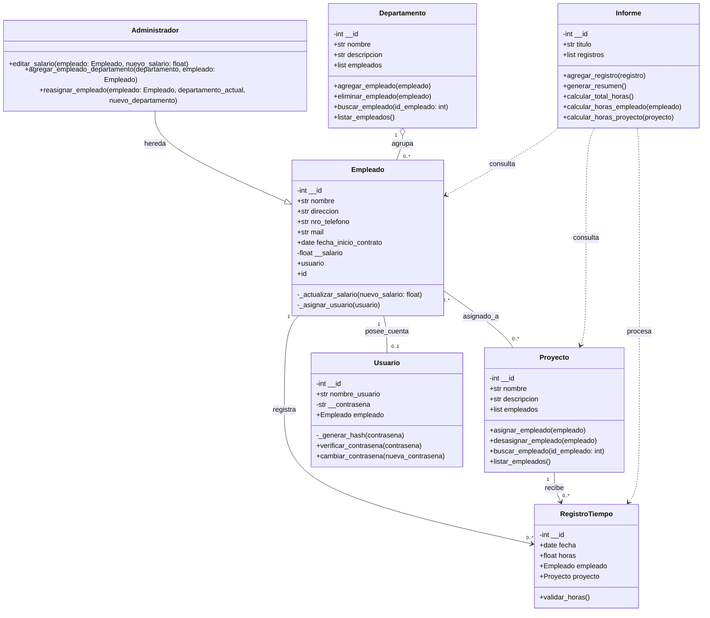

# Informe Técnico: Optimización de Sistema en EcoTech Solutions

**Asignatura:** Programación Orientada a Objetos 
**Estudiante:** Natalia Trejo Tallón 
**Docente:** Rubén Schnettler  
**Institución:** INACAP Valparaíso

____________________________________________

## Índice
1. Introducción
2. Sección 1: Análisis Conceptual
3. Sección 2: Diseño del Sistema (Modelo Estructural UML)
4. Sección 3: Uso de Herramientas de IA Generativa
5. Sección 4: Mejoras Aplicadas y Principios de Diseño
6. Conclusiones y Reflexión
7. Referencias Bibliográficas

____________________________________________

## Introducción
La empresa **EcoTech Solutions**, dedicada al desarrollo de tecnologías sostenibles, ha presentado problemas de administración debido a su crecimiento acelerado. Actualmente utiliza sistemas aislados y planillas de cálculo, provocando duplicidad de datos, errores en asignación de proyectos, falta de trazabilidad en horas y vulnerabilidades en la seguridad de datos personales.

El objetivo general de este proyecto es diseñar un modelo conceptual y estructural orientado a objetos y enfocado en **POO Seguro**, utilizando la notación UML como base arquitectónica para solucionar las deficiencias del sistema actual mediante un diseño robusto, mantenible y escalable.

____________________________________________

## 2. Sección 1: Análisis Conceptual

### 2.1 Identificación y Jerarquización de las 6 Entidades del Dominio

Para solucionar integralmente el caso de EcoTech Solutions, se han identificado y jerarquizado 6 entidades del sistema:

1. **`Empleado` (Entidad Principal):** Representa al talento humano de la empresa.
   - *Atributos:* `-id: int` (privado), `+nombre: string`, `+direccion: string`, `+nro_telefono: string`, `+mail: string`, `+fechaInicioContrato: date`, `-salario: float` (privado).
   - *Responsabilidad:* Almacenar la información contractual y de contacto del colaborador, resguardando datos sensibles como el salario.

   - *Métodos:* `+asignarDepartamento(depto)`.


2. **`Departamento` (Entidad Organizacional):** Agrupa áreas funcionales de la empresa.
   - *Atributos:* `+idDepto: int`, `+nombre: string`, `+gerenteAsociado: string`.
   - *Responsabilidad:* Administrar la estructura organizativa y gestionar la asignación y reasignación del personal.

   - *Métodos:* `+agregarEmpleado(emp)`, `+crearDepto()`, `+editarDepto()`, `+buscarDepto()`, `+eliminarDepto()`, `+reasignarEmpleado()`.


3. **`Proyecto` (Entidad Operativa):** Representa las iniciativas y desarrollos sostenibles.
   - *Atributos:* `+idProyecto: int`, `+nombre: string`, `+descripcion: string`, `+fechaInicio: date`.
   - *Responsabilidad:* Gestionar el ciclo de vida de los proyectos y la incorporación o desvinculación de colaboradores asignados.

   - *Métodos:* `+crearProyecto()`, `+editarProyecto()`, `+eliminarProyecto()`, `+asignarEmpleado()`, `+desasignarEmpleado()`.

4. **`RegistroTiempo` (Entidad Transaccional):** Control de tiempos de trabajo.
   - *Atributos:* `+idRegistro: int`, `+fecha: date`, `+horas: float`, `+descripcion: string`.
   - *Responsabilidad:* Registrar e imputar las horas trabajadas por cada colaborador en proyectos específicos con validación de consistencia.

   - *Métodos:* `+validarHoras(): bool`.

5. **`Usuario` (Entidad de Seguridad / POO Seguro):** Gestión de accesos e identidad.
   - *Atributos:* `+idUsuario: int`, `+username: string`, `-passwordHash: string` (privado), `+rol: string`.
   - *Responsabilidad:* Garantizar la autenticación segura y la autorización basada en roles.

   - *Métodos:* `+autenticar(pass): bool`, `+verificarPermiso(módulo): bool`.

6. **`Informe` (Entidad de Salida / Reportabilidad):** Generación de reportes institucionales.
   - *Atributos:* `+idInforme: int`, `+tipoInforme: String`, `+fechaGeneracion: String`.
   - *Responsabilidad:* Procesar los datos transaccionales y consolidados para exportación segura.

   - *Métodos:* `+exportarPDF(): bool`, `+exportarExcel(): bool`.

### 2.2 Vinculación de Problemas con Fundamentos de POO

* **Encapsulamiento y POO Seguro:** El salario (`-salario`) en `Empleado` y el hash de clave (`-passwordHash`) en `Usuario` se definen con visibilidad privada (`-`). Esto previene el acceso no autorizado y la manipulación directa de datos financieros y credenciales.

* **Abstracción:** Se encapsulan las operaciones del ciclo de vida (CRUD) dentro de las entidades correspondientes (`Departamento` y `Proyecto`), ocultando la complejidad del manejo interno de datos.

* **Relaciones de Agregación y Composición:**
  - *Agregación (`Departamento` o-- `Empleado`):* La eliminación de un departamento no destruye los registros de los empleados asociados.
  - *Composición (`Empleado` *-- `RegistroTiempo` y `Proyecto` *-- `RegistroTiempo`):* Las horas registradas dependen directamente de la existencia del empleado y del proyecto al que se imputan.


## 3. Diagrama de Clases UML en Código Mermaid

```mermaid
classDiagram

    class Empleado {
        -int id
        +string nombre
        +string direccion
        +string nro_telefono
        +string mail
        +date fechaInicioContrato
        -float salario
        +asignarDepartamento(depto)
    }

    class Departamento {
        +int idDepto
        +string nombre
        +string gerenteAsociado
        +agregarEmpleado(emp)
        +crearDepto
        +editarDepto
        +buscarDepto
        +eliminarDepto
        +reasignarEmpleado
    }

    class Proyecto {
        +int idProyecto
        +string nombre
        +string descripcion
        +date fechaInicio
        +crearProyecto
        +editarProyecto
        +eliminarProyecto
        +asignarEmpleado
        +desasignarEmpleado
    }

    class RegistroTiempo {
        +int idRegistro
        +date fecha
        +float horas
        +string descripcion
        +validarHoras() bool
    }

    class Usuario {
        +int idUsuario
        +string username
        -string passwordHash
        +string rol
        +autenticar(pass) bool
        +verificarPermiso(módulo) bool
    }

    class Informe {
        +int idInforme
        +string tipoInforme
        +string fechaGeneracion
        +exportarPDF() bool
        +exportarExcel() bool
    }

    Departamento "1" o-- "0..*" Empleado : agrupa (Agregación)
    Empleado "1" *-- "0..*" RegistroTiempo : posee (Composición)
    Proyecto "1" *-- "0..*" RegistroTiempo : imputa (Composición)
    Empleado "0..*" -- "0..*" Proyecto : asignado_a (Asociación)
    Empleado "1" -- "1" Usuario : posee_cuenta (Asociación 1:1)
    Informe ..> RegistroTiempo : procesa (Dependencia)
    Informe ..> Empleado : procesa (Dependencia)
```


## 4. Uso de Herramientas de IA

### 4.1 Prompts Utilizados e Iteraciones
- Prompt 1 (Generación Inicial):

"Actúa como un arquitecto de software experto en POO Seguro. Genera un diagrama de clases UML inicial para EcoTech Solutions con las clases Empleado, Departamento, Proyecto y RegistroTiempo. Incluye visibilidad, tipos de datos y multiplicidad."

- Prompt 2 (Inclusión de Seguridad y Refinamiento de Métodos Operativos):

"Revisa el diagrama anterior. Aplica principios de POO Seguro incorporando las entidades Usuario (autenticación) e Informe (exportación). Además, expande las clases Departamento y Proyecto agregando métodos CRUD y de asignación de personal para solucionar la desorganización operativa del caso."


### 4.2 Matriz de Comparación y Evaluación Crítica

| N.º | Criterio / elemento | Diseño manual definitivo | Propuesta de IA generativa | Evaluación crítica y decisión |
|---:|---|---|---|---|
| 1 | **Manejo de autenticación** | Entidad `Usuario` independiente, con `passwordHash` privado y control de acceso mediante roles (`rol`). | Credenciales (`username` y `password`) dentro de `Empleado`. | **Descartado:** Viola el principio de responsabilidad única (SRP). |
| 2 | **Datos de empleado** | Incluye datos de contacto y contrato: `direccion`, `nro_telefono`, `mail` y `fechaInicioContrato`. | Solo incluye atributos genéricos como `nombre` y `correo`. | **Ajuste manual:** Se incorporó información administrativa completa. |
| 3 | **Operaciones CRUD** | `Departamento` y `Proyecto` gestionan operaciones de crear, editar, eliminar y asignar empleados. | Clases pasivas, sin métodos de gestión. | **Ajuste manual:** Se aumentó la cohesión y se evitó dispersar la lógica. |
| 4 | **Generación de informes** | Clase `Informe` con dependencias hacia `RegistroTiempo` y `Empleado`. | Funciones globales o integradas en clases operativas. | **Modificado:** Se centralizó la exportación a PDF y Excel, reduciendo el acoplamiento. |


## 5. Mejoras Aplicadas y Principios de Diseño

### 5.1 Mejoras Aplicadas y Principios de Diseño
- esponsabilidad Única (SRP): Usuario gestiona la seguridad, Informe la   salida de reportes, Empleado resguarda datos del trabajador y Proyecto/Departamento administran sus respectivos ciclos de vida.

- Alta Cohesión: Todas las operaciones agrupadas en Departamento (crearDepto, reasignarEmpleado, etc.) y Proyecto pertenecen estrictamente al dominio de cada entidad.

- Encapsulamiento y Bajo Acoplamiento: Los datos sensibles (salario, passwordHash) se mantienen ocultos y protegidos bajo visibilidad privada (-).

### 5.2 Matriz de Trazabilidad de Requerimientos

| Requerimiento del Caso | Clase Responsable | Atributos Asociados | Métodos / Operaciones Asociadas |
| :--- | :--- | :--- | :--- |
| **R1: Registro y Ficha de Empleados** | `Empleado` | `- id: int`<br>`+ nombre: string`<br>`+ direccion: string`<br>`+ nro_telefono: string`<br>`+ mail: string`<br>`+ fechaInicioContrato: date` | `+ asignarDepartamento()` |
| **R2: Gestión de Departamentos y Reasignación** | `Departamento` | `+ idDepto: int`<br>`+ nombre: string`<br>`+ gerenteAsociado: string` | `+ agregarEmpleado()`<br>`+ crearDepto()`<br>`+ editarDepto()`<br>`+ buscarDepto()`<br>`+ eliminarDepto()`<br>`+ reasignarEmpleado()` |
| **R3: Gestión de Proyectos e Integrantes** | `Proyecto` | `+ idProyecto: int`<br>`+ nombre: string`<br>`+ descripcion: string`<br>`+ fechaInicio: date` | `+ crearProyecto()`<br>`+ editarProyecto()`<br>`+ eliminarProyecto()`<br>`+ asignarEmpleado()`<br>`+ desasignarEmpleado()` |
| **R4: Control y Trazabilidad de Horas** | `RegistroTiempo` | `+ idRegistro: int`<br>`+ fecha: date`<br>`+ horas: float`<br>`+ descripcion: string` | `+ validarHoras(): bool` |
| **R5: Seguridad, Autenticación y Datos Sensibles (POO Seguro)** | `Empleado`<br>`Usuario` | `- salario: float`<br>`+ idUsuario: int`<br>`+ username: string`<br>`- passwordHash: string`<br>`+ rol: string` | `+ autenticar()`<br>`+ verificarPermiso()` |
| **R6: Generación y Exportación de Reportes** | `Informe` | `+ idInforme: int`<br>`+ tipoInforme: String`<br>`+ fechaGeneracion: String` | `+ exportarPDF(): bool`<br>`+ exportarExcel(): bool` |


____________________________________________________

# Informe actualizado: Diseño UML e implementación POO segura de EcoTech Solutions

> **Nota de actualización:** Este documento incorpora los cambios realizados durante la implementación en Python. El diseño UML inicial se mantuvo como referencia y, siguiendo la indicación del docente, se documentan los ajustes realizados en lugar de rehacer el trabajo desde cero.

## 2.1 Entidades y responsabilidades del diseño actualizado

Para solucionar integralmente el caso de EcoTech Solutions, se mantienen las entidades principales identificadas en el diseño inicial y se incorpora `Administrador` como especialización de `Empleado`, de acuerdo con la implementación realizada en Python.

### 1. `Empleado` (Entidad Principal)

Representa al talento humano de la empresa.

- **Atributos:** `-id: int` (privado), `+nombre: str`, `+direccion: str`, `+nro_telefono: str`, `+mail: str`, `+fecha_inicio_contrato: date`, `-salario: float` (privado), `+usuario`.
- **Responsabilidad:** Almacenar la información contractual y de contacto del colaborador, protegiendo datos sensibles como el identificador y el salario. También mantiene la referencia a la cuenta de usuario asociada.
- **Métodos principales:**
  - `+id` mediante `@property`, para consultar el identificador de forma controlada.
  - `-_actualizar_salario(nuevo_salario: float)`, que valida que el salario no sea negativo.
  - `-_asignar_usuario(usuario)`, que permite asociar una cuenta de usuario y evita una segunda asociación.

### 2. `Administrador` (Especialización de `Empleado`)

Representa a un empleado que posee responsabilidades administrativas dentro del sistema.

- **Herencia:** `Administrador` hereda de `Empleado`.
- **Responsabilidad:** Utilizar las operaciones de gestión que corresponden al rol administrativo, delegando la modificación de salarios y la gestión de empleados en las clases responsables.
- **Métodos:**
  - `+editar_salario(empleado, nuevo_salario)`
  - `+agregar_empleado_departamento(departamento, empleado)`
  - `+reasignar_empleado(empleado, departamento_actual, nuevo_departamento)`

La inclusión de esta clase constituye uno de los principales cambios respecto del diseño UML inicial. Se decidió representar explícitamente la especialización porque en la implementación existe un comportamiento administrativo que reutiliza los atributos y características de `Empleado`.

### 3. `Departamento` (Entidad Organizacional)

Agrupa a los empleados que pertenecen a un área de la empresa.

- **Atributos:** `-id: int` (privado), `+nombre: str`, `+descripcion: str`, `+empleados: list`.
- **Responsabilidad:** Administrar su propia colección de empleados, permitiendo agregarlos, eliminarlos y buscarlos.
- **Métodos:**
  - `+agregar_empleado(empleado)`
  - `+eliminar_empleado(empleado)`
  - `+buscar_empleado(id_empleado: int)`
  - `+listar_empleados()`

**Cambio respecto del diseño inicial:** se eliminó `gerenteAsociado` porque no fue necesario para la lógica finalmente implementada. También se incorporó `descripcion` y la colección de empleados.

### 4. `Proyecto` (Entidad Operativa)

Representa las iniciativas y desarrollos de EcoTech Solutions.

- **Atributos:** `-id: int` (privado), `+nombre: str`, `+descripcion: str`, `+empleados: list`.
- **Responsabilidad:** Administrar los empleados asignados a un proyecto.
- **Métodos:**
  - `+asignar_empleado(empleado)`
  - `+desasignar_empleado(empleado)`
  - `+buscar_empleado(id_empleado: int)`
  - `+listar_empleados()`

**Cambio respecto del diseño inicial:** se eliminó `fechaInicio` porque no fue utilizada en la implementación actual. Los métodos CRUD generales que aparecían en el diseño inicial fueron reemplazados por operaciones directamente relacionadas con la responsabilidad de la clase y con la gestión de su colección de empleados.

### 5. `RegistroTiempo` (Entidad Transaccional)

Representa el registro de horas trabajadas por un empleado en un proyecto determinado.

- **Atributos:** `-id: int` (privado), `+fecha: date`, `+horas: float`, `+empleado: Empleado`, `+proyecto: Proyecto`.
- **Responsabilidad:** Registrar horas trabajadas y validar que el registro tenga una cantidad de horas válida y referencias correctas a un empleado y a un proyecto.
- **Método:**
  - `+validar_horas(): bool`

**Cambio respecto del diseño inicial:** se eliminó `descripcion` porque no forma parte de la implementación actual. Se incorporaron referencias explícitas a `Empleado` y `Proyecto`, ya que cada registro necesita identificar quién trabajó y en qué proyecto.

### 6. `Usuario` (Entidad de Seguridad / POO Seguro)

Representa la cuenta de acceso asociada a un empleado.

- **Atributos:** `-id: int` (privado), `+nombre_usuario: str`, `-contrasena: str` (privado), `+empleado: Empleado`.
- **Responsabilidad:** Gestionar las credenciales de acceso de forma que la contraseña no se almacene directamente, sino mediante un hash, y mantener la asociación con un empleado.
- **Métodos:**
  - `-_generar_hash(contrasena)`
  - `+verificar_contrasena(contrasena)`
  - `+cambiar_contrasena(nueva_contrasena)`

La asociación entre `Empleado` y `Usuario` se implementa como una relación 1:1. `Usuario` recibe un objeto `Empleado` y `Empleado` mantiene una referencia a su usuario. Además, `_asignar_usuario()` impide asociar una segunda cuenta al mismo empleado.

### 7. `Informe` (Entidad de Reportabilidad)

Representa una estructura encargada de procesar registros de tiempo para obtener información consolidada.

- **Atributos:** `-id: int` (privado), `+titulo: str`, `+registros: list`.
- **Responsabilidad:** Administrar una colección de registros de tiempo y generar información resumida a partir de ellos.
- **Métodos:**
  - `+agregar_registro(registro)`
  - `+generar_resumen()`
  - `+calcular_total_horas()`
  - `+calcular_horas_empleado(empleado)`
  - `+calcular_horas_proyecto(proyecto)`

**Cambio respecto del diseño inicial:** se descartaron `exportarPDF()` y `exportarExcel()` porque esas operaciones no forman parte de la implementación actual de la clase. El foco quedó en procesar y calcular información a partir de `RegistroTiempo`.

---

## 2.2 Vinculación de Problemas con Fundamentos de POO

- **Encapsulamiento y POO Seguro:** El identificador y el salario de `Empleado`, junto con el identificador y la contraseña almacenada de `Usuario`, se mantienen como atributos privados. El salario solo puede actualizarse mediante `_actualizar_salario()`, que incorpora una validación.

- **Abstracción:** Las clases exponen operaciones relacionadas con sus propias responsabilidades. Por ejemplo, `Departamento` administra su colección de empleados y `Proyecto` administra sus empleados asignados, mientras que `Informe` procesa los registros de tiempo.

- **Herencia:** `Administrador` hereda de `Empleado`, ya que un administrador representa también a un empleado y reutiliza sus atributos y comportamiento común.

- **Asociación:** `Empleado` se relaciona con `Usuario` mediante una asociación 1:1. `Empleado` y `Proyecto` mantienen una relación N:M mediante sus colecciones de empleados.

- **Dependencia:** `Informe` depende de `RegistroTiempo` para procesar los registros y de los objetos `Empleado` y `Proyecto` contenidos en ellos.

- **Delegación:** `Administrador` no manipula directamente las listas internas de `Departamento`. En su lugar, utiliza los métodos `agregar_empleado()` y `eliminar_empleado()` de la clase correspondiente. Esto mantiene las responsabilidades separadas y evita duplicar lógica.

---

## 2.3 Validaciones implementadas

Durante la implementación se agregaron validaciones para evitar estados incorrectos:

- `Departamento` solo acepta objetos que sean instancias de `Empleado`.
- `Departamento` impide agregar dos veces al mismo empleado y controla la eliminación de empleados no pertenecientes.
- `Proyecto` solo acepta objetos que sean instancias de `Empleado` y evita duplicar asignaciones.
- `RegistroTiempo` exige que las horas sean mayores que cero.
- `RegistroTiempo` valida que `empleado` sea un objeto `Empleado` y que `proyecto` sea un objeto `Proyecto`.
- `Usuario` valida que el empleado asociado sea un objeto `Empleado`.
- `Usuario` impide que un empleado tenga una segunda cuenta.
- `Usuario` no almacena la contraseña original, sino un hash generado mediante `hashlib`.
- `Usuario` impide cambiar la contraseña por una cadena vacía.
- `Empleado` impide asignar un salario negativo.

Estas validaciones fueron probadas durante la implementación mediante casos válidos y casos que provocan `ValueError` o `TypeError`, según corresponda.

---

# 3. Diagrama de Clases UML actualizado en Mermaid

El siguiente diagrama representa la versión actualmente implementada en Python:



### Nota sobre las multiplicidades

En la implementación actual:

- Un `Departamento` puede contener cero o muchos empleados.
- Un `Empleado` puede participar en cero o muchos proyectos, y un `Proyecto` puede tener cero o muchos empleados.
- Un `Empleado` puede tener cero o una cuenta `Usuario`. La lógica de `Empleado` y `Usuario` evita que un mismo empleado tenga más de una cuenta.
- Un `Empleado` puede tener cero o muchos registros de tiempo.
- Un `Proyecto` puede tener cero o muchos registros de tiempo.
- `Informe` procesa registros existentes, por lo que su relación con `RegistroTiempo` se representa como dependencia.

---

## 3.1 Cambios realizados respecto del UML inicial

El primer diagrama UML se utilizó como punto de partida para la implementación. Durante el desarrollo se detectó que algunas responsabilidades, atributos y relaciones necesitaban ajustarse para representar correctamente el comportamiento que finalmente se implementó en Python.

Los principales cambios fueron:

| Elemento | Diseño inicial | Diseño implementado | Motivo del cambio |
|---|---|---|---|
| `Empleado` | Tenía `asignarDepartamento()` | Se agregó `@property id`, `_actualizar_salario()` y `_asignar_usuario()` | Permitir encapsulamiento, validación del salario y control de la relación con `Usuario`. |
| `Administrador` | No estaba representado como clase independiente | Hereda de `Empleado` | Se identificó un comportamiento administrativo específico y se aplicó herencia. |
| `Departamento` | `gerenteAsociado` y varios métodos CRUD | `descripcion`, colección `empleados` y operaciones de agregar, eliminar, buscar y listar | Se ajustó la clase a las responsabilidades realmente implementadas. |
| `Proyecto` | Incluía `fechaInicio` y CRUD general | Mantiene nombre y descripción, además de la colección de empleados y operaciones de asignación | Se priorizaron las responsabilidades efectivamente implementadas. |
| `RegistroTiempo` | Incluía `descripcion` | Mantiene fecha y horas, y referencia a `Empleado` y `Proyecto` | El registro necesita identificar al trabajador y proyecto involucrados. |
| `Usuario` | Incluía `username`, `passwordHash` y `rol` | Incluye nombre de usuario, contraseña almacenada como hash y referencia a `Empleado` | Se implementó la relación 1:1 y el manejo de contraseña mediante hash. |
| `Informe` | Se enfocaba en exportar PDF y Excel | Procesa registros y calcula horas | Se implementaron primero las responsabilidades de procesamiento y generación de resumen. |
| Relaciones | No existía herencia de `Administrador` | `Administrador` hereda de `Empleado` | Representa explícitamente la especialización implementada. |

Estos cambios no reemplazan el trabajo inicial, sino que documentan su evolución desde el diseño conceptual hacia una implementación funcional.

---

# 4. Uso de Herramientas de IA

## 4.1 Prompts Utilizados e Iteraciones

- **Prompt 1 (Generación Inicial):**

  "Actúa como un arquitecto de software experto en POO Seguro. Genera un diagrama de clases UML inicial para EcoTech Solutions con las clases Empleado, Departamento, Proyecto y RegistroTiempo. Incluye visibilidad, tipos de datos y multiplicidad."

- **Prompt 2 (Inclusión de Seguridad y Refinamiento de Métodos Operativos):**

  "Revisa el diagrama anterior. Aplica principios de POO Seguro incorporando las entidades Usuario (autenticación) e Informe (exportación). Además, expande las clases Departamento y Proyecto agregando métodos CRUD y de asignación de personal para solucionar la desorganización operativa del caso."

- **Iteración posterior durante la implementación:**

  Se utilizó asistencia de IA para contrastar el diseño UML con la implementación real en Python. A partir de las pruebas y de la revisión de responsabilidades, se ajustaron atributos, métodos y relaciones. La decisión final no se tomó únicamente a partir de la propuesta de IA, sino considerando la coherencia con el código implementado y las pruebas realizadas.

---

## 4.2 Matriz de Comparación y Evaluación Crítica

| N.º | Criterio / elemento | Diseño inicial / propuesta | Diseño implementado | Evaluación crítica y decisión |
|---:|---|---|---|---|
| 1 | **Autenticación y seguridad** | `Usuario` con credenciales y rol | `Usuario` con nombre de usuario, contraseña almacenada como hash y relación con `Empleado` | **Ajuste manual:** se priorizó separar las responsabilidades de seguridad de los datos generales del empleado y controlar la relación 1:1. |
| 2 | **Datos de empleado** | Datos de contacto y contrato | Se mantienen los datos de contacto y contrato, además de encapsular ID y salario | **Ajuste manual:** se incorporaron mecanismos de encapsulamiento y validación. |
| 3 | **Gestión de departamentos** | CRUD y asignación de empleados dentro de `Departamento` | Agregar, eliminar, buscar y listar empleados | **Modificado:** se implementaron operaciones concretas sobre la colección de empleados. |
| 4 | **Gestión de proyectos** | CRUD general y asignación de empleados | Asignar, desasignar, buscar y listar empleados | **Modificado:** se concentró la lógica en la responsabilidad principal de la clase. |
| 5 | **Registro de tiempo** | Datos de fecha, horas y descripción | Fecha, horas, `Empleado` y `Proyecto`, con validaciones | **Ajuste manual:** se incorporaron referencias a los objetos relacionados para representar la trazabilidad del registro. |
| 6 | **Generación de informes** | Exportación a PDF y Excel | Resumen y cálculos de horas | **Modificado:** se implementó primero el procesamiento de registros y el cálculo de información consolidada. |
| 7 | **Especialización administrativa** | No estaba representada | `Administrador` hereda de `Empleado` | **Ajuste manual:** se agregó herencia para representar el rol administrativo y reutilizar el comportamiento común. |

La IA fue utilizada como herramienta de apoyo para generar y revisar propuestas. Las decisiones finales fueron contrastadas con el código, las responsabilidades de cada clase y las pruebas realizadas.

---

# 5. Mejoras Aplicadas y Principios de Diseño

## 5.1 Mejoras Aplicadas y Principios de Diseño

- **Responsabilidad Única (SRP):** `Empleado` administra la información del trabajador; `Departamento` y `Proyecto` gestionan sus respectivas colecciones; `RegistroTiempo` representa los registros de horas; `Usuario` administra las credenciales; `Informe` procesa la información de los registros; `Administrador` coordina operaciones administrativas.

- **Alta Cohesión:** Las operaciones se agrupan según la responsabilidad de cada clase. Por ejemplo, `Departamento` administra empleados y `Proyecto` administra asignaciones de empleados.

- **Encapsulamiento:** Los atributos sensibles y los identificadores internos se mantienen privados. El salario se modifica mediante un método que valida el valor recibido.

- **Bajo Acoplamiento:** `Administrador` delega las operaciones de gestión a `Departamento` en lugar de manipular directamente su lista interna.

- **Validación y manejo de errores:** Se utilizan `ValueError` y `TypeError` para impedir datos inválidos, objetos incorrectos, duplicaciones y asociaciones no permitidas.

- **POO Seguro:** La contraseña no se almacena directamente. Se genera un hash mediante `hashlib` y se compara el hash de la contraseña ingresada para verificarla.

## 5.2 Matriz de Trazabilidad de Requerimientos

| Requerimiento del Caso | Clase Responsable | Atributos Asociados | Métodos / Operaciones Asociadas |
|---|---|---|---|
| **R1: Registro y Ficha de Empleados** | `Empleado` | `-id: int`, `+nombre: str`, `+direccion: str`, `+nro_telefono: str`, `+mail: str`, `+fecha_inicio_contrato: date`, `-salario: float` | `+id`, `-_actualizar_salario()` |
| **R2: Gestión de Departamentos y Reasignación** | `Departamento`, `Administrador` | `Departamento`: `-id`, `+nombre`, `+descripcion`, `+empleados` | `agregar_empleado()`, `eliminar_empleado()`, `buscar_empleado()`, `listar_empleados()`, `Administrador.reasignar_empleado()` |
| **R3: Gestión de Proyectos e Integrantes** | `Proyecto` | `-id`, `+nombre`, `+descripcion`, `+empleados` | `asignar_empleado()`, `desasignar_empleado()`, `buscar_empleado()`, `listar_empleados()` |
| **R4: Control y Trazabilidad de Horas** | `RegistroTiempo` | `-id`, `+fecha`, `+horas`, `+empleado`, `+proyecto` | `validar_horas()` |
| **R5: Seguridad, Autenticación y Datos Sensibles (POO Seguro)** | `Empleado`, `Usuario` | `Empleado`: `-id`, `-salario`, `+usuario`; `Usuario`: `-id`, `+nombre_usuario`, `-contrasena`, `+empleado` | `_actualizar_salario()`, `_asignar_usuario()`, `_generar_hash()`, `verificar_contrasena()`, `cambiar_contrasena()` |
| **R6: Generación y procesamiento de reportes** | `Informe` | `-id`, `+titulo`, `+registros` | `agregar_registro()`, `generar_resumen()`, `calcular_total_horas()`, `calcular_horas_empleado()`, `calcular_horas_proyecto()` |

---

## 5.3 Validación de la implementación

La implementación fue probada progresivamente mediante casos válidos y casos de error. Entre las pruebas realizadas se encuentran:

- creación de objetos de cada clase;
- herencia de `Administrador` desde `Empleado`;
- actualización de salario válida e inválida;
- incorporación, búsqueda, listado y eliminación de empleados en `Departamento`;
- asignación, búsqueda, listado y desasignación de empleados en `Proyecto`;
- validación de horas en `RegistroTiempo`;
- validación del tipo de empleado y proyecto asociados a un registro;
- creación de usuarios y verificación de contraseñas;
- cambio de contraseña;
- prevención de una segunda cuenta para el mismo empleado;
- incorporación de registros a `Informe`;
- generación de resumen;
- cálculo del total de horas;
- cálculo de horas por empleado;
- cálculo de horas por proyecto.

Las pruebas permitieron detectar y ajustar diferencias entre el diseño conceptual inicial y el comportamiento que realmente se necesitaba implementar.