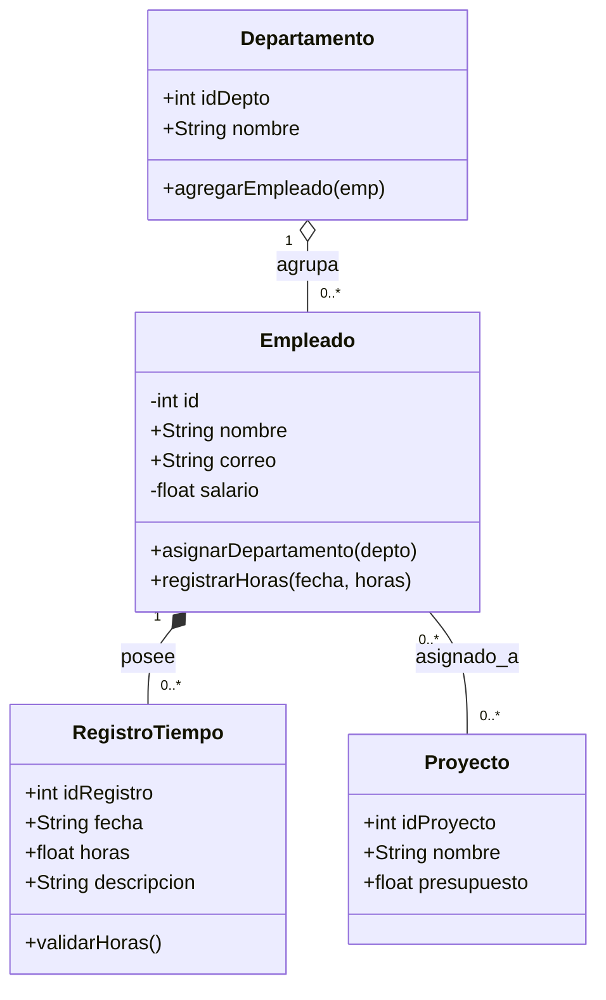

# Análisis Conceptual

## Identificación de Entidades

1) Empleado: Representa a los trabajadores de la empresa.
   Atributos: id (int), nombre (str), correo (str), _salario (float).
   
   Responsabilidad: Gestionar la información personal del trabajador y garantizar la privacidad de sus datos.

2) Departamento: Representa un área funcional (ej: Desarrollo, Sustentabilidad).
   Atributos: id_depto (int), nombre (str).

   Responsabilidad: Agrupar a los empleados sin ser dueño absoluto de sus vidas laborales (si el departamento cierra, los empleados no se eliminan).

3) Proyecto: Representa las iniciativas o clientes de la empresa.
   Atributos: id_proyecto (int), nombre (str), presupuesto (float).

   Responsabilidad: Controlar el alcance de los trabajos asignados.

4) RegistroTiempo: Representa la hoja de marcaje de horas trabajadas.
   Atributos: id_registro (int), fecha (str), horas (float), descripcion (str).
   
   Responsabilidad: Registrar el tiempo exacto que un empleado dedica a un proyecto.

# Diagrama UML Inicial
