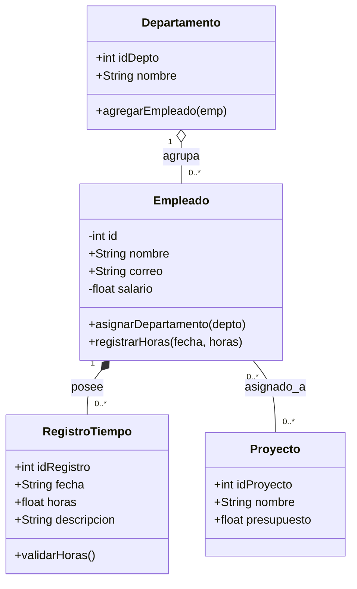

# Análisis Conceptual

## Identificación de Entidades

1) Empleado: Representa a los trabajadores de la empresa.
   Atributos: id (int), nombre (str), correo (str), _salario (float).
   
   Responsabilidad: Gestionar la información personal del trabajador y garantizar la privacidad de sus datos.

2) Departamento: Representa un área funcional (ej: Desarrollo, Sustentabilidad).
   Atributos: id_depto (int), nombre (str).

   Responsabilidad: Agrupar a los empleados sin ser dueño absoluto de sus vidas laborales (si el departamento cierra, los empleados no se eliminan).

3) Proyecto: Representa las iniciativas o clientes de la empresa.
   Atributos: id_proyecto (int), nombre (str), presupuesto (float).

   Responsabilidad: Controlar el alcance de los trabajos asignados.

4) RegistroTiempo: Representa la hoja de marcaje de horas trabajadas.
   Atributos: id_registro (int), fecha (str), horas (float), descripcion (str).
   
   Responsabilidad: Registrar el tiempo exacto que un empleado dedica a un proyecto.

## Diagrama UML Inicial

## Uso de Inteligencial Artificial
1) Primer Prompt: "Actúa como un arquitecto de software experto en POO. Diseña un diagrama de clases UML para la empresa EcoTech Solutions que incluya las clases Empleado, Departamento, Proyecto y RegistroTiempo. Especifica visibilidad (+/-), tipos de datos y multiplicidad. Devuelve el resultado en formato gráfico o Mermaid."

2) Segundo Prompt: "Revisa el siguiente diseño UML de EcoTech Solutions. Evalúa si cumple con el principio de Responsabilidad Única, si maneja adecuadamente el encapsulamiento para datos sensibles y qué fallas de acoplamiento ves."

### Matriz de Comparación: Diseño Manual vs. Sugerencias de la IA

| Criterio / Elemento | Diseño Manual | Propuesta de la IA | Análisis Crítico y Decisión Tomada |
| :--- | :--- | :--- | :--- |
| **Encapsulamiento de Salario** | Atributo `salario` privado (`-`). | Sugirió hacer privados todos los atributos y agregar getters/setters. | **Aceptado:** Se adoptó la sugerencia de la IA para reforzar la seguridad de todos los atributos sensibles. |
| **Arquitectura de Control** | Clases bien definidas y separadas por responsabilidad. | Creó una clase monolítica gigante llamada `GestorSistema`. | **Descartado:** La propuesta de la IA rompe el principio de Responsabilidad Única (SRP) y genera alto acoplamiento. |
| **Relación Registro-Empleado** | Composición entre `Empleado` y `RegistroTiempo`. | Asociación simple entre `Proyecto` y `RegistroTiempo`. | **Modificado:** Se mantuvo la composición con `Empleado` para garantizar que un registro no exista huérfano sin un trabajador asignado. |
| **Identificadores Únicos** | IDs enteros autoincrementables simples (`int`). | Sugirió usar identificadores globales aleatorios tipo UUID. | **Descartado:** Para el alcance actual del proyecto, los IDs enteros son más simples y funcionales. |

### Matriz de Trazabilidad de Requerimientos

| Requerimiento del Caso | Clase Responsable | Atributos Asociados | Métodos / Operaciones Asociadas |
| :--- | :--- | :--- | :--- |
| **R1: Registro de Empleados** | `Empleado` | `- id: int` `+ nombre: str` `+ correo: str` | `+ __init__()` `+ obtener_info()` |
| **R2: Asignación a Departamento** | `Departamento` `Empleado` | `+ nombre: str` `+ empleados: list` | `+ agregar_empleado()` |
| **R3: Trazabilidad de Horas** | `RegistroTiempo` `Empleado` | `+ fecha: str` `+ horas: float` `+ descripcion: str` | `+ registrar_horas()` |
| **R4: Seguridad de Datos Sensibles** | `Empleado` | `- salario: float` | `+ obtener_salario()` `+ modificar_salario()` |
| **R5: Validación de Entradas** | `RegistroTiempo` | `+ horas: float` | `+ validar_horas()` |