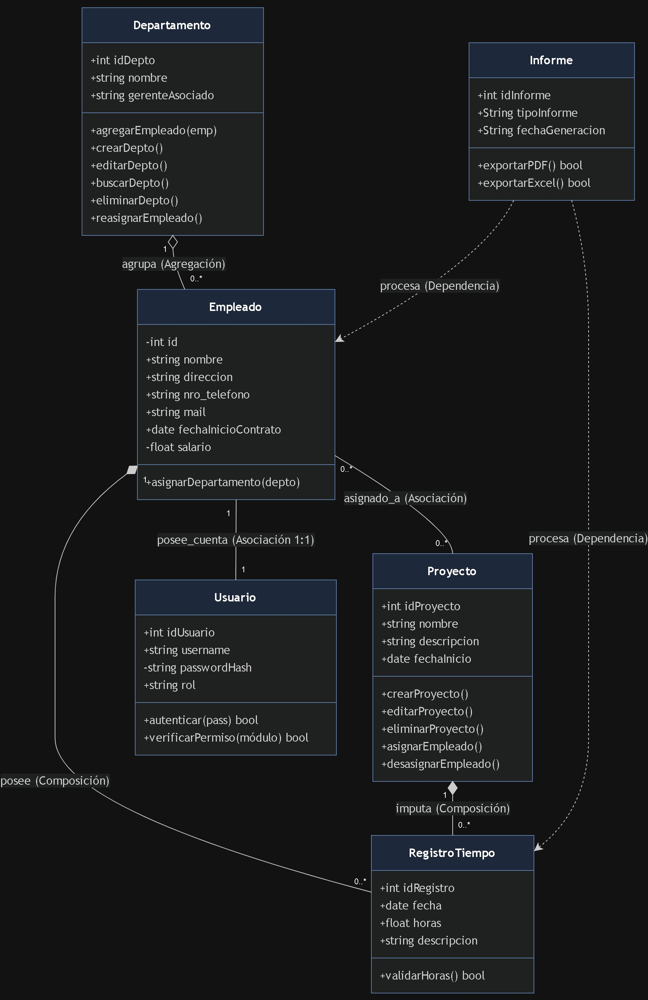

# Informe Técnico: Optimización de Sistema en EcoTech Solutions

**Asignatura:** Programación Orientada a Objetos 
**Estudiante:** Natalia Trejo Tallón 
**Docente:** Rubén Schnettler  
**Institución:** INACAP Valparaíso

____________________________________________

## Índice
1. Introducción
2. Sección 1: Análisis Conceptual
3. Sección 2: Diseño del Sistema (Modelo Estructural UML)
4. Sección 3: Uso de Herramientas de IA Generativa
5. Sección 4: Mejoras Aplicadas y Principios de Diseño
6. Conclusiones y Reflexión
7. Referencias Bibliográficas

____________________________________________

## Introducción
La empresa **EcoTech Solutions**, dedicada al desarrollo de tecnologías sostenibles, ha presentado problemas de administración debido a su crecimiento acelerado. Actualmente utiliza sistemas aislados y planillas de cálculo, provocando duplicidad de datos, errores en asignación de proyectos, falta de trazabilidad en horas y vulnerabilidades en la seguridad de datos personales.

El objetivo general de este proyecto es diseñar un modelo conceptual y estructural orientado a objetos y enfocado en **POO Seguro**, utilizando la notación UML como base arquitectónica para solucionar las deficiencias del sistema actual mediante un diseño robusto, mantenible y escalable.

____________________________________________

## 2. Sección 1: Análisis Conceptual

### 2.1 Identificación y Jerarquización de las 6 Entidades del Dominio

Para solucionar integralmente el caso de EcoTech Solutions, se han identificado y jerarquizado 6 entidades del sistema:

1. **`Empleado` (Entidad Principal):** Representa al talento humano de la empresa.
   - *Atributos:* `-id: int` (privado), `+nombre: string`, `+direccion: string`, `+nro_telefono: string`, `+mail: string`, `+fechaInicioContrato: date`, `-salario: float` (privado).
   - *Responsabilidad:* Almacenar la información contractual y de contacto del colaborador, resguardando datos sensibles como el salario.

   - *Métodos:* `+asignarDepartamento(depto)`.


2. **`Departamento` (Entidad Organizacional):** Agrupa áreas funcionales de la empresa.
   - *Atributos:* `+idDepto: int`, `+nombre: string`, `+gerenteAsociado: string`.
   - *Responsabilidad:* Administrar la estructura organizativa y gestionar la asignación y reasignación del personal.

   - *Métodos:* `+agregarEmpleado(emp)`, `+crearDepto()`, `+editarDepto()`, `+buscarDepto()`, `+eliminarDepto()`, `+reasignarEmpleado()`.


3. **`Proyecto` (Entidad Operativa):** Representa las iniciativas y desarrollos sostenibles.
   - *Atributos:* `+idProyecto: int`, `+nombre: string`, `+descripcion: string`, `+fechaInicio: date`.
   - *Responsabilidad:* Gestionar el ciclo de vida de los proyectos y la incorporación o desvinculación de colaboradores asignados.

   - *Métodos:* `+crearProyecto()`, `+editarProyecto()`, `+eliminarProyecto()`, `+asignarEmpleado()`, `+desasignarEmpleado()`.

4. **`RegistroTiempo` (Entidad Transaccional):** Control de tiempos de trabajo.
   - *Atributos:* `+idRegistro: int`, `+fecha: date`, `+horas: float`, `+descripcion: string`.
   - *Responsabilidad:* Registrar e imputar las horas trabajadas por cada colaborador en proyectos específicos con validación de consistencia.

   - *Métodos:* `+validarHoras(): bool`.

5. **`Usuario` (Entidad de Seguridad / POO Seguro):** Gestión de accesos e identidad.
   - *Atributos:* `+idUsuario: int`, `+username: string`, `-passwordHash: string` (privado), `+rol: string`.
   - *Responsabilidad:* Garantizar la autenticación segura y la autorización basada en roles.

   - *Métodos:* `+autenticar(pass): bool`, `+verificarPermiso(módulo): bool`.

6. **`Informe` (Entidad de Salida / Reportabilidad):** Generación de reportes institucionales.
   - *Atributos:* `+idInforme: int`, `+tipoInforme: String`, `+fechaGeneracion: String`.
   - *Responsabilidad:* Procesar los datos transaccionales y consolidados para exportación segura.

   - *Métodos:* `+exportarPDF(): bool`, `+exportarExcel(): bool`.

### 2.2 Vinculación de Problemas con Fundamentos de POO

* **Encapsulamiento y POO Seguro:** El salario (`-salario`) en `Empleado` y el hash de clave (`-passwordHash`) en `Usuario` se definen con visibilidad privada (`-`). Esto previene el acceso no autorizado y la manipulación directa de datos financieros y credenciales.

* **Abstracción:** Se encapsulan las operaciones del ciclo de vida (CRUD) dentro de las entidades correspondientes (`Departamento` y `Proyecto`), ocultando la complejidad del manejo interno de datos.

* **Relaciones de Agregación y Composición:**
  - *Agregación (`Departamento` o-- `Empleado`):* La eliminación de un departamento no destruye los registros de los empleados asociados.
  - *Composición (`Empleado` *-- `RegistroTiempo` y `Proyecto` *-- `RegistroTiempo`):* Las horas registradas dependen directamente de la existencia del empleado y del proyecto al que se imputan.


## 3. Diagrama de Clases UML en Código Mermaid

```mermaid
classDiagram

    class Empleado {
        -int id
        +string nombre
        +string direccion
        +string nro_telefono
        +string mail
        +date fechaInicioContrato
        -float salario
        +asignarDepartamento(depto)
    }

    class Departamento {
        +int idDepto
        +string nombre
        +string gerenteAsociado
        +agregarEmpleado(emp)
        +crearDepto
        +editarDepto
        +buscarDepto
        +eliminarDepto
        +reasignarEmpleado
    }

    class Proyecto {
        +int idProyecto
        +string nombre
        +string descripcion
        +date fechaInicio
        +crearProyecto
        +editarProyecto
        +eliminarProyecto
        +asignarEmpleado
        +desasignarEmpleado
    }

    class RegistroTiempo {
        +int idRegistro
        +date fecha
        +float horas
        +string descripcion
        +validarHoras() bool
    }

    class Usuario {
        +int idUsuario
        +string username
        -string passwordHash
        +string rol
        +autenticar(pass) bool
        +verificarPermiso(módulo) bool
    }

    class Informe {
        +int idInforme
        +string tipoInforme
        +string fechaGeneracion
        +exportarPDF() bool
        +exportarExcel() bool
    }

    Departamento "1" o-- "0..*" Empleado : agrupa (Agregación)
    Empleado "1" *-- "0..*" RegistroTiempo : posee (Composición)
    Proyecto "1" *-- "0..*" RegistroTiempo : imputa (Composición)
    Empleado "0..*" -- "0..*" Proyecto : asignado_a (Asociación)
    Empleado "1" -- "1" Usuario : posee_cuenta (Asociación 1:1)
    Informe ..> RegistroTiempo : procesa (Dependencia)
    Informe ..> Empleado : procesa (Dependencia)
```



## 4. Uso de Herramientas de IA

### 4.1 Prompts Utilizados e Iteraciones
- Prompt 1 (Generación Inicial):

"Actúa como un arquitecto de software experto en POO Seguro. Genera un diagrama de clases UML inicial para EcoTech Solutions con las clases Empleado, Departamento, Proyecto y RegistroTiempo. Incluye visibilidad, tipos de datos y multiplicidad."

- Prompt 2 (Inclusión de Seguridad y Refinamiento de Métodos Operativos):

"Revisa el diagrama anterior. Aplica principios de POO Seguro incorporando las entidades Usuario (autenticación) e Informe (exportación). Además, expande las clases Departamento y Proyecto agregando métodos CRUD y de asignación de personal para solucionar la desorganización operativa del caso."


### 4.2 Matriz de Comparación y Evaluación Crítica